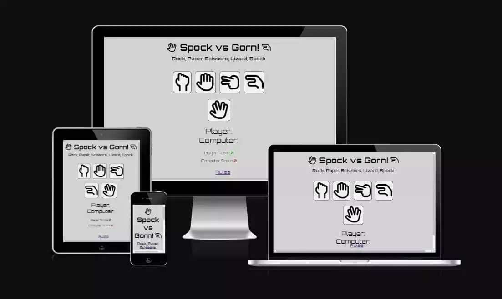
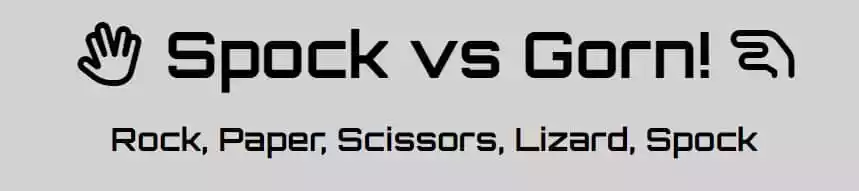
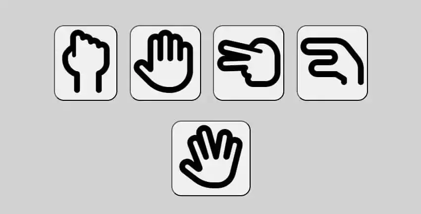
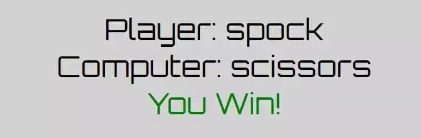
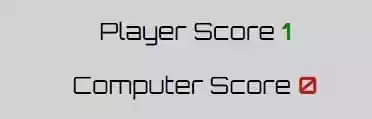
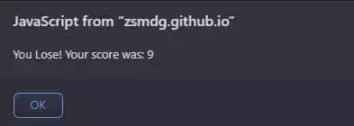
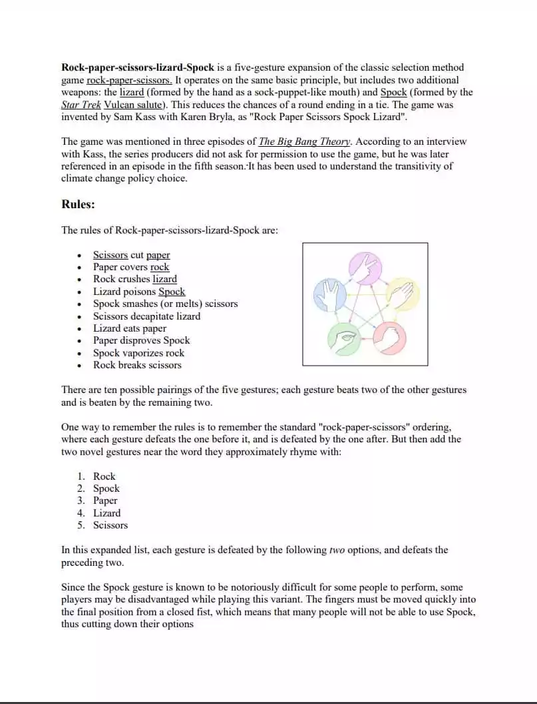
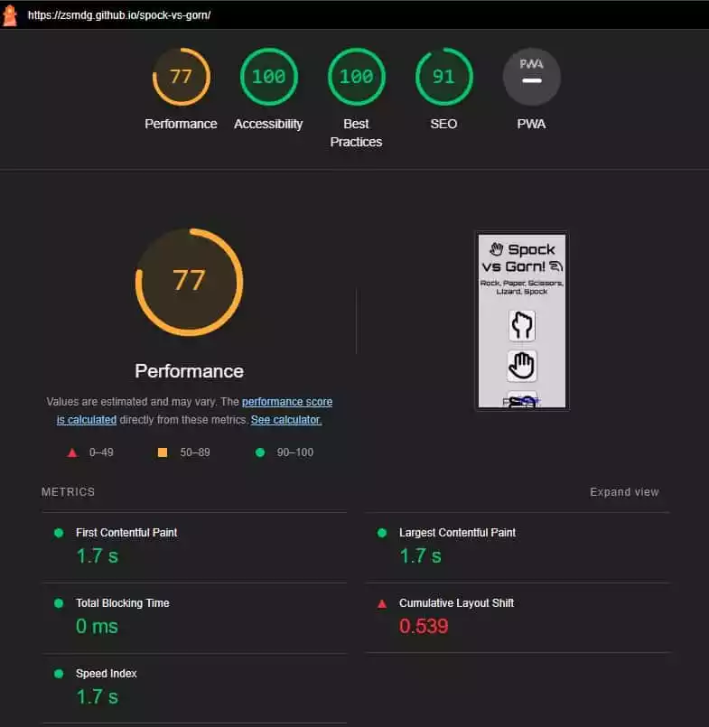

# Spock vs Gorn

Ever wonder who would win between the Gorn and Spock or a piece of paper?
Well wonder no more with Spock vs Gorn those questions will be answered.

Learn the rules of "Rock, Paper, Scissors, Lizard, Spock" and find out who the supreme being (or mineral) is! this site will be targeted towards adults and children.

## Feautures

### Header

- At the top of the page is the name of the game and it's components
- It tells the user what game they are playing

## The Game Results

- After the user clicks an icon javascript is executed to chose a random option for the computer player
- The choice that the player made and computer made is displayed under the choice icons
- Under that the current score for the player and computer is displayed
- When the computer's score reaches 5 the game is over and a alert message is displayed informing the player of their final score
- Then the game is reset

## Footer

- The footer section has a link to an external source on the rules of "Rock, Paper, Scissors, Lizard, Spock"

## Testing

- I tested playing this game in different browsers: Chrome, Firefox.
- I confirmed the game results are always correct
- I confirmed that the correct choice is always displayed
- I confirmed that the score is always updated
- I confirmed that the game over alert message is displayed at the correct time
- I confirmed that the link to the rules page works
- I confirmed that the colors and fonts chosen are easy to read and accessible by running it through lighthouse in devtools

## Validator Testing

- HTML
  - No errors were returned when passing through the official W3C validator

- CSS
  - No errors were returned when passing through the official W3C CSS validator

- Javascript
  - No errors were returned when passing the code through JSHINT

## Unfixed Issues

The site is not very resposive I've tried alot of different CSS styling to get it to be responsive but couldn't

## Deployment

- The site was deployed to GitHub pages.
- The steps to deploy are as follows: 
  - In the GitHub repository, navigate to the Settings tab
  - From the source section drop-down menu, select the Master Branch
  - Once the master branch has been selected, the page will be automatically refreshed with a detailed ribbon display to indicate the successful deployment.

The live link can be found here - https://zsmdg.github.io/spock-vs-gorn/

## Media

- Code was taken from previous projects: love running, love maths.
- I was very lost on this project so I followed this tutorial on youtube: https://www.youtube.com/watch?v=3uKdQx-SZ5A